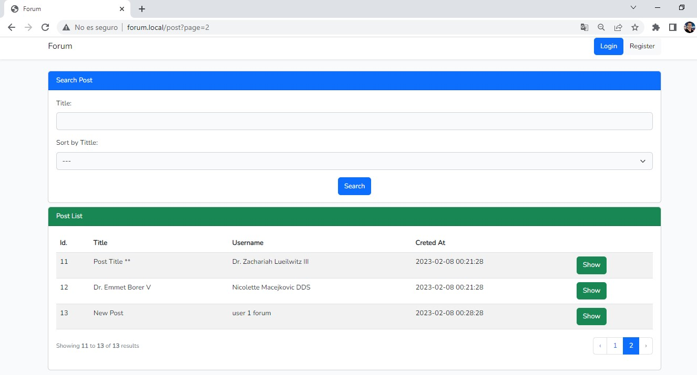
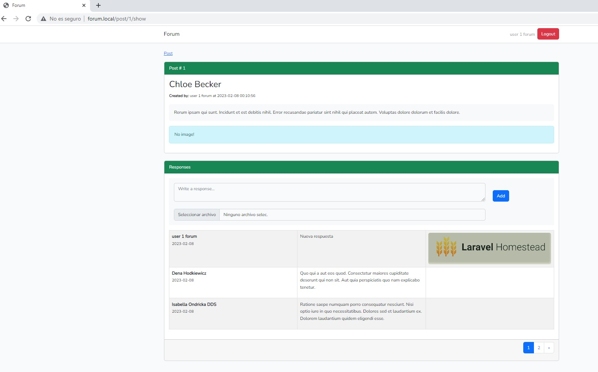

# Forum

This forum application allows creating posts and adding responses to the post.

## Installation Steps

Copy .env.example file and change the name to .env, then edit and set your Database config
```
DB_CONNECTION=mysql
DB_HOST=127.0.0.1
DB_PORT=3306
DB_DATABASE=forum
DB_USERNAME=root
DB_PASSWORD=
```

```
composer install

npm install

npm run build
```

Generate encryption key
```
php artisan key:generate
```

Run migrations and seeder to create Users, Posts, and Responses tables and fake data.

It will take some minutes because it creates 10000 post and 1000 users.
```
php artisan migrate --seed
```


You can use this user or check the DB, all user has the password: "password":

- **Email:** root@forum.com **Password:** password

To visualize the loaded images execute:

```
php artisan storage:link
``` 

To execute tests
```
php artisan test
``` 

The project content:
- Migrations
- Seeders
- Factories
- 2 vue components
- Fetures tests



